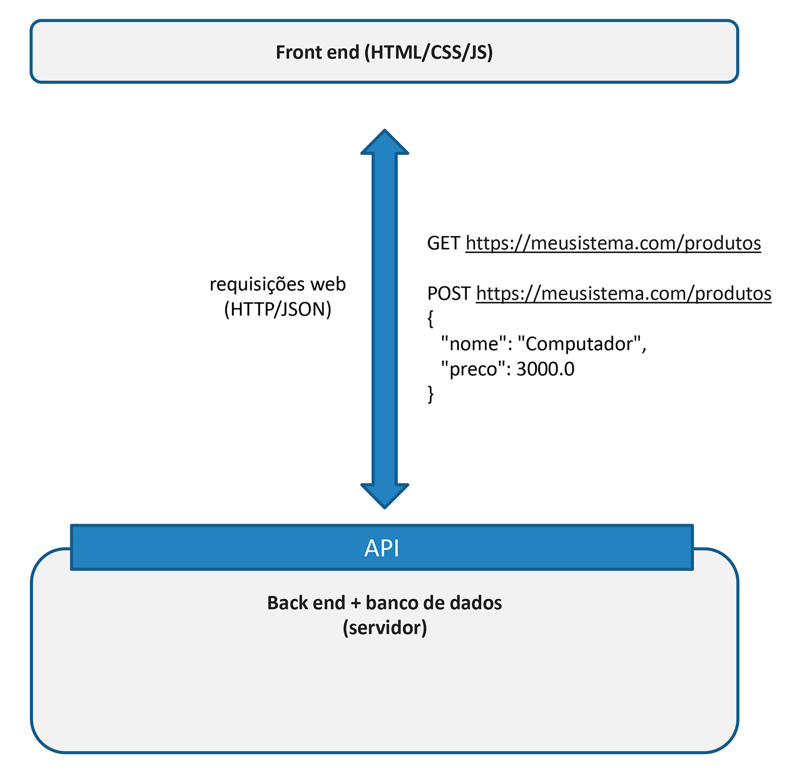
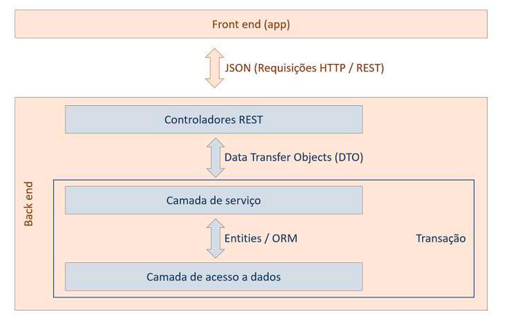
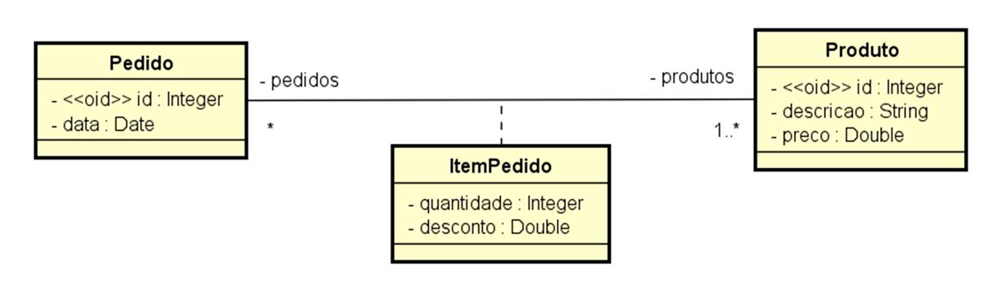
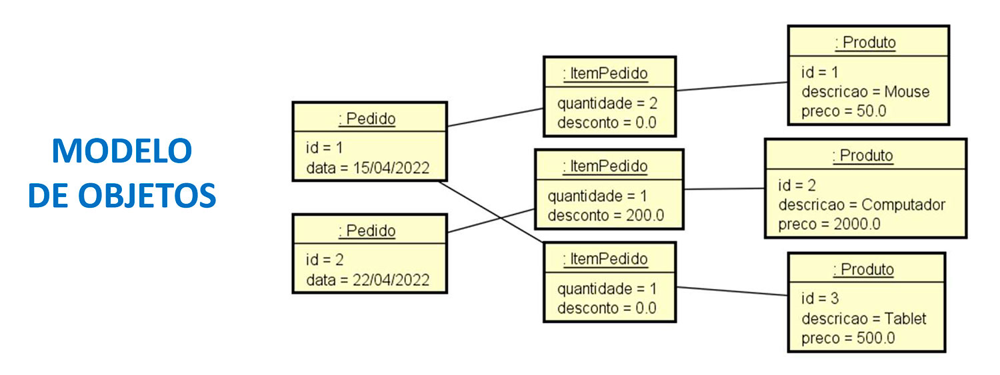
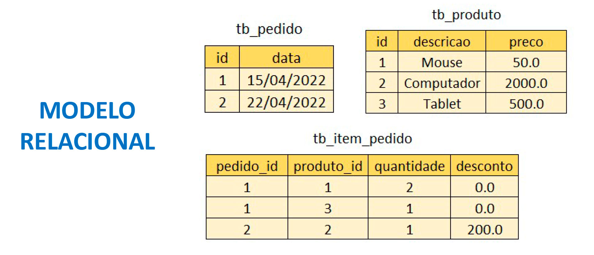

# Projeto DSList - Intensivão Java Spring

## Finalidade do projeto

* Criar um projeto Java Spring para conhecimento e para acrescentar ao currículo
* Conhecer o caminho para carreira back end Java

## Temas abordados - 1º Dia

### Sistemas Web


---

### API Rest



---

### Padrão Camadas



---

### Resumo - 1º Dia

* Conceitos
  * Sistemas web e recursos
  * Cliente/servidor, HTTP, JSON
  * Padrão Rest para API web
* Estruturação de projeto Spring Rest
* Entidades e ORM
* Database seeding
* Padrão camadas
* Controller, service, repository
* Padrão DTO

---

## Temas abordados - 2º Dia

### Relacionamentos







---

### Resumo - 2º Dia

* Relacionamentos N-N
* Classe de associação, embedded id
* Consultas SQL no Spring Data JPA
* Projections

---

## Temas abordados - 3º Dia

### Perfis de projeto

#### 1. Perfil de desenvolvimento e testes:
  **test**<br/>
  Banco de dados H2

#### 2. Perfil de homologação / staging:**
  **dev**<br/>
  Banco de dados Postgres de homologação

#### 3. Perfil de produção:**
  **prod**<br/>
  Banco de dados Postgres de produção

---
  
### Passos homologação

#### Preparação do ambiente
Docker ou Postgresql + pgAdmin ou DBeaver

#### Homologação local

1. Criar perfis de projeto<br/>
/* system.properties
2. Gerar script da base de dados<br/>
/* apagar arquivo gerado
3. Criar base de dados de homologação
4. Rodar app no modo dev e validar

### Passos deploy CI/CD

#### Pré-requisitos
- Conta no Railway
- Conta no Github com mais de 90 dias
- Projeto Spring Boot salvo no seu Github
- Script SQL para criação e seed da base de dados
- Aplicativo de gestão de banco instalado (pgAdmin ou DBeaver)

#### Passos Railway
1. Prover um servidor de banco de dados
2. Criar a base de dados e seed
3. Criar uma aplicação Railway vinculada a um repositório Github
4. Configurar variáveis de ambiente

```
APP_PROFILE
DB_URL (Formato: jdbc:postgresql://host:porta/nomedabase)
DB_USERNAME
DB_PASSWORD
CORS_ORIGINS
```

5. Configurar o domínio público para a aplicação
6. Testar app no Postman
7. Testar a esteira de CI/CD