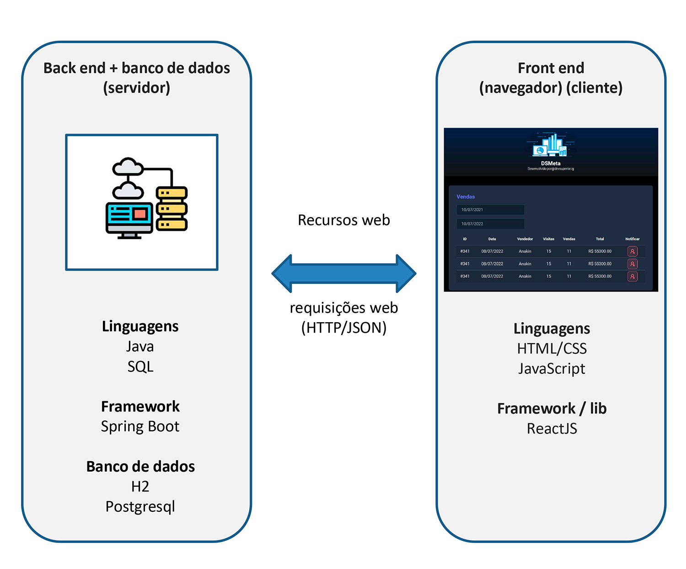

# Projeto DSList - Intensivão Java Spring

## Finalidade do projeto

* Criar um projeto Java Spring para conhecimento e para acrescentar ao currículo
* Conhecer o caminho para carreira back end Java

## Temas abordados - 1º Dia

### Sistemas Web

---

### API Rest

---

### Padrão Camadas

---

### Resumo - 1º Dia

* Conceitos
  * Sistemas web e recursos
  * Cliente/servidor, HTTP, JSON
  * Padrão Rest para API web
* Estruturação de projeto Spring Rest
* Entidades e ORM
* Database seeding
* Padrão camadas
* Controller, service, repository
* Padrão DTO

